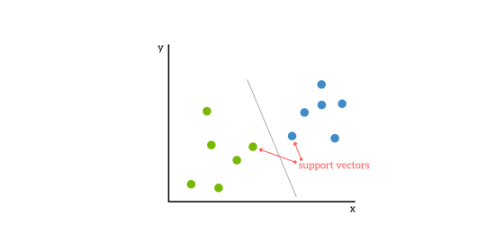
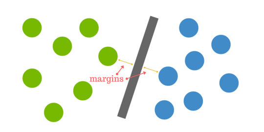

# Support Vector Machines

A Support Vector Machine (SVM) is a machine learning model, capable of performing linear or nonlinear classification, regression, and even outlier detection [1].
SVMs are particularly well suited for classification of complex small- or medium-sized datasets.

## How Support Vector Machines work

SVMs are based on the idea of finding a hyperplane that best divides a dataset into classes (binary classification example in the image below) [3].

### Support Vectors
Support vectors are the data points nearest to the hyperplane, the points of a data set that, if removed, would alter the position of the dividing hyperplane. Because of this, they can be considered the critical elements of a data set.

### Hyperplane 
You can think of a hyperplane as a line that linearly separates and classifies a set of data (in 2-Dimensional space).

Intuitively, the further from the hyperplane our data points lie, the more confident we are that they have been correctly classified. We therefore want our data points to be as far away from the hyperplane as possible, while still being on the correct side of it.

So when new testing data is added, whatever side of the hyperplane it lands will decide the class that we assign to it.

### Finding the right hyperplane

The distance between the hyperplane and the nearest data point from either set is known as the margin. The goal is to choose a hyperplane with the greatest possible margin between the hyperplane and any point within the training set, giving a greater chance of new data being classified correctly.

### Kernelling

But what happens when there is no clear hyperplane? This is where it can get tricky. Data is rarely ever as clean as our simple example above. A dataset will often look more like the jumbled balls below which represent a linearly non separable dataset.

In order to classify a dataset like the one above it’s necessary to move away from a 2d view of the data to a 3d view. Imagine that our two sets of colored balls above are sitting on a sheet and this sheet is lifted suddenly, launching the balls into the air. While the balls are up in the air, you use the sheet to separate them. This ‘lifting’ of the balls represents the mapping of data into a higher dimension. 

This is known as kernelling - artificially increasing dimensionality.

Because we are now in three dimensions, our hyperplane can no longer be a line. It must now be a plane as shown in the example above. The idea is that the data will continue to be mapped into higher and higher dimensions until a hyperplane can be formed to segregate it.

## SVM Uses
 
SVM is used for text classification tasks such as category assignment, detecting spam and sentiment analysis. It is also commonly used for image recognition challenges, performing particularly well in aspect-based recognition and color-based classification. SVM also plays a vital role in many areas of handwritten digit recognition, such as postal automation services.

The advantages of SVMs:

- Effective in high dimensional spaces [2]
- Still effective in cases where number of dimensions is greater than the number of samples
- Uses a subset of training points in the decision function (called support vectors), so it is also memory efficient
- Versatile: different Kernel functions can be specified for the decision function. Common kernels are provided, but it is also possible to specify custom kernels.
- Works well on smaller cleaner datasets [3]

The disadvantages of SVMs: 

- If the number of features is much greater than the number of samples, avoiding over-fitting by choosing Kernel functions and regularization term is crucial [2]
- SVMs do not directly provide probability estimates, these are calculated using an expensive five-fold cross-validation.

## References

1. Aurelien Geron. Hands-On Machine Learning with Scikit-Learn, Keras and TensorFlow. 2019
2. [Scikit-Learn: Support Vector Machines](https://scikit-learn.org/stable/modules/svm.html)
3. [Support Vector Machines: A Simple Explanation](https://www.kdnuggets.com/2016/07/support-vector-machines-simple-explanation.html)
